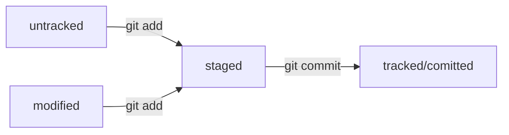

# git-hints

## Небольшой гит-репозиторий для самостоятельной работы

`git clone https://github.com/PraktikumJava/git-hints.git`

HEAD -- это голова.
Коммит -- это всему голова.
Статусы файлов:
<тут пустая строка!>

<и тут пустая строка!>
